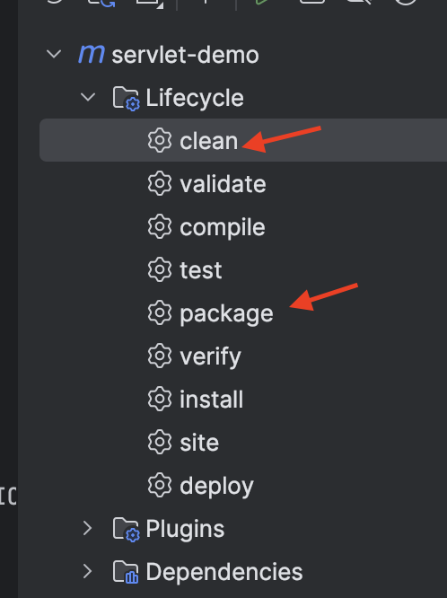

# Deploy Servlet App to Tomcat

## Environment

- Docker Desktop: [https://www.docker.com/products/docker-desktop/](https://www.docker.com/products/docker-desktop/)
- Source Code: [git@github.com](mailto:git@github.com):You-Ivan/servlet-demo.git

## Steps:

### Step 1: Prepare the war file

1. Run the clean and build command 
   
    
    
    
    
    
    
    
    
2. You should see the a war file named “servlet-demo” under the target folder
   
    
    

### Step 2: Run tomcat container

1. Run the latest tomcat image
   
    
    
2. Configure the name and port mapping of the container, then click “Run”
   
    
    
3. Open terminal under your project folder and execute this command
   
    ```bash
    docker cp target/servlet-demo.war tomcat-server:/usr/local/tomcat/webapps
    ```
    
4. You should see your war file been successfully copied to the /webapps folder under tomcat
   
    
    
    
    

### Step 3: Open your app in browser

Copy this url and hit enter: [http://localhost:8082/servlet-demo/hello](http://localhost:8082/servlet-demo/hello)

